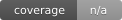

# Filings B3 

[](https://www.repostatus.org/#active)


[](https://snyk.io/test/github/guilhermegor/filings-b3)
[](https://snyk.io/advisor/python/filings-b3)

[](https://github.com/astral-sh/ruff)




Biblioteca Python simples e eficiente para acessar os conjuntos de dados públicos da B3 (a bolsa
brasileira). Cada _reader_ transforma um pregão em um `pandas.DataFrame` tipado, validado por
contrato e com proveniência — valores monetários como `Decimal` exato, nunca um `float` com perda.

## ✨ Principais recursos

### 📊 Readers do Boletim Diário (BDI)
- [`BdiStocksSummaryReader`](https://guilhermegor.github.io/filings-b3/api/reference/) — o resumo por pregão do mercado à vista de ações (`DailyAverageStocks`).
- [`BdiBtbLendingOpenPositionsReader`](https://guilhermegor.github.io/filings-b3/api/reference/) — o retrato das posições em aberto de empréstimo de ativos (BTB) (`BTBLendingOpenPosition`).

### 🔒 Fidelidade por construção
- **Tipagem explícita** — toda coluna tipada na carga, nunca a inferência do pandas.
- **Decimais exatos** — dinheiro e qualquer valor cuja parte fracionária importa é `decimal.Decimal`, nunca um `float` binário.
- **Contratos** — uma fonte que remove uma coluna obrigatória falha de forma barulhenta com `ContractError`, verificado contra os layouts publicados pela própria B3.

### 🧾 Proveniência & camada bronze
- Seis colunas de proveniência em todo _frame_ (`url`, `updated_at`, `source_key`, `package_version`, `ingestion_run_id`, `content_hash`).
- Passe `path_raw=` para reter cada página bruta da fonte para a camada bronze de um _datalake_.

## 🚀 Primeiros passos

### Pré-requisitos
- Python 3.10+
- Poetry (recomendado)
- Opcional: Makefile

### Instalação

**Opção 1: Pip (recomendado)**
```bash
pip install filings-b3
```

**Opção 2: Build a partir do código-fonte**
```bash
git clone https://github.com/guilhermegor/filings-b3.git
cd filings-b3
pyenv install 3.12.2
pyenv local 3.12.2
poetry install --no-root
poetry shell
```

### Uso básico
```python
from datetime import date
from filings_b3.daily_bulletin import BdiBtbLendingOpenPositionsReader

df = BdiBtbLendingOpenPositionsReader(date(2025, 1, 2)).read()
print(df[["TCKR_SYMB", "STOCK_BALANCE", "BALANCE"]].head())
```

Importar pela **macro-seção** (`filings_b3.daily_bulletin`) é a forma organizada e preferida; a
reexportação plana a partir da raiz (`from filings_b3 import BdiBtbLendingOpenPositionsReader`)
continua válida por retrocompatibilidade.

`date_ref` é **obrigatório** — o endpoint do BDI é endereçado por data, então não existe um padrão
"mais recente". Veja a [documentação](https://guilhermegor.github.io/filings-b3/) para cada _reader_
e mais receitas.

### Rodando os testes
```bash
poetry run pytest tests/unit/ -v
poetry run pytest tests/integration/ -v
```

## 📂 Estrutura do projeto
```
filings-b3/
├── .github/
│   ├── workflows/
│   ├── CODEOWNERS
│   └── PULL_REQUEST_TEMPLATE.md
├── assets/
│   └── b3-logo.jpg
├── bin/
├── docs/
├── src/filings_b3/
│   ├── daily_bulletin/          # readers do Boletim Diário do Pregão (BDI)
│   ├── search_trading_session/  # readers da Pesquisa por Pregão
│   └── _internal/               # privado: contracts, utils, ports
├── tests/
│   ├── unit/
│   ├── integration/
│   └── performance/
├── LICENSE
├── Makefile
├── poetry.lock
├── pyproject.toml
├── README.md
└── requirements.txt
```

## 👨‍💻 Autores
- guilhermegor — [GitHub](https://github.com/guilhermegor) | [LinkedIn](https://www.linkedin.com/in/guilhermegor)

## 📜 Licença
Este projeto é licenciado sob a Licença MIT — veja [LICENSE](LICENSE).

## 🔗 Links úteis
- [Documentação](https://guilhermegor.github.io/filings-b3/)
- [Repositório no GitHub](https://github.com/guilhermegor/filings-b3)
- [Rastreador de issues](https://github.com/guilhermegor/filings-b3/issues)
